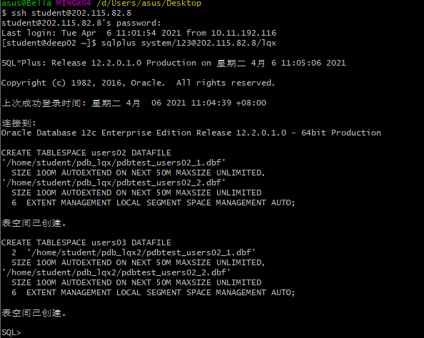
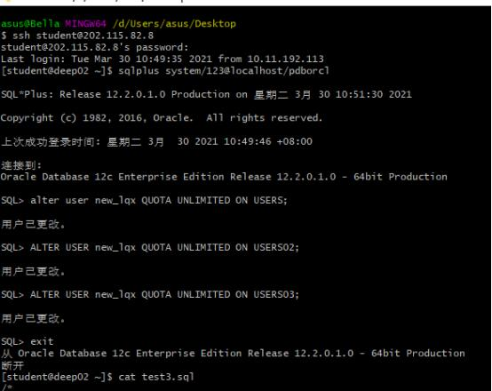
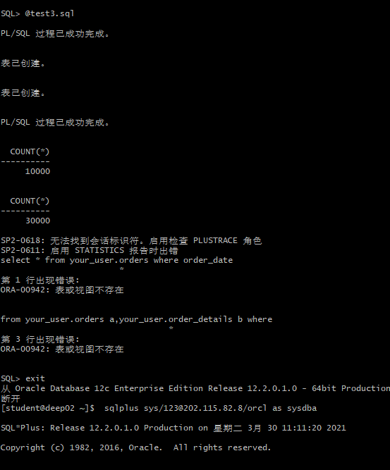
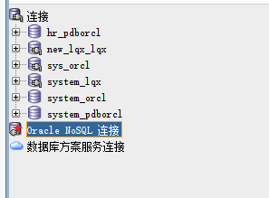
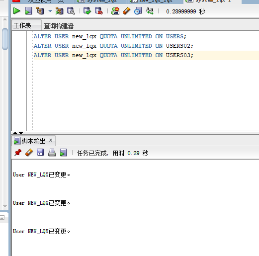
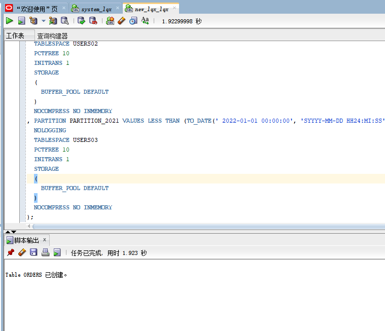
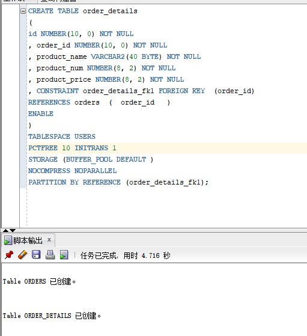
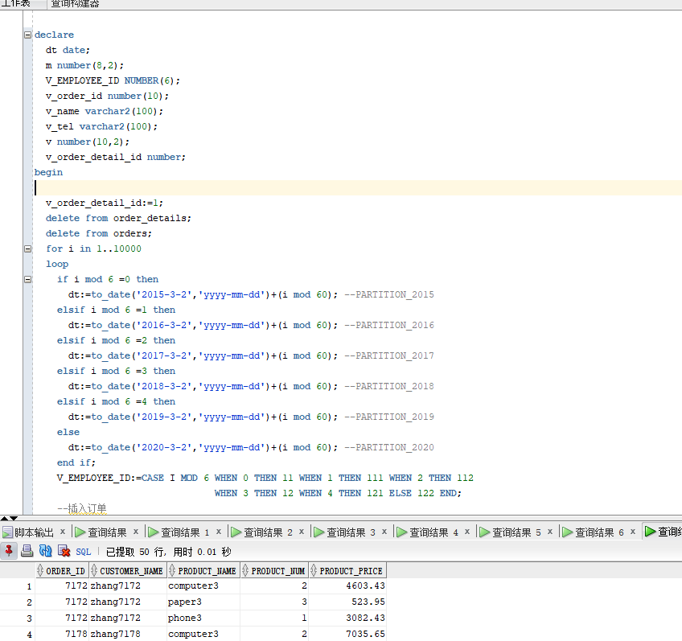
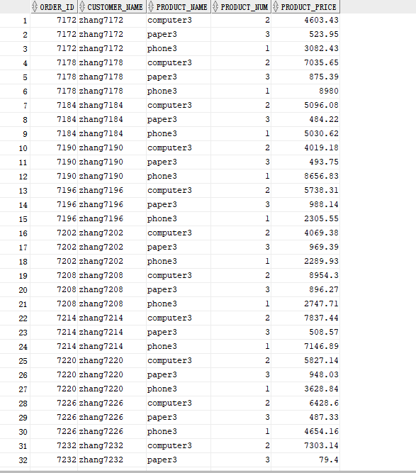
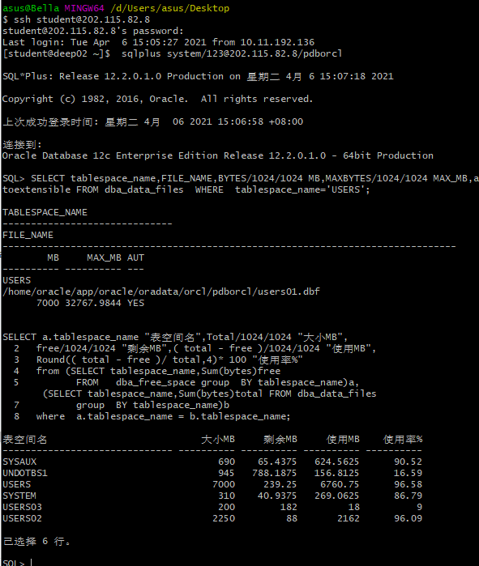

# 实验3 创建分区表

### 刘青霞 学号：201810414404  班级：软件工程4班

### 实验目的
> 掌握分区表的创建方法，掌握各种分区方式的使用场景。

### 实验内容
- 在表空间中创建两张表：订单表（订单）与订单详表（order_details）。
- 使用你自己的帐户创建本实验的表，表创建在上述3个分区，自定义分区策略。
- 你需要使用系统用户给你自己的账号分配上述分区的使用权限。你需要使用系统用户给你的用户分配可以查询执行计划的权限。
- 表创建成功后，插入数据，数据能并平均分布到各个分区。每个表的数据都应该大于1万行，对表进行联合查询。
- 写出插入数据的语句和查询数据的语句，并分析语句的执行计划。
- 进行分区与不分区的对比实验。

### 实验步骤
- **第一步：以System身份登录，更改用户的权限**

- **第二步：以自己的账号new_lqx身份登录，并运行脚本文件test3.sql**

- **第三步：新建立连接system_lqx**

- **第四步：创建users02、users03**

- **第五步：新建立连接new_lqx_lqx**

- **第六步：以system用户登录lqx数据库，修改users02、users03的权限**

- **第七步：创建orders表和order_details表**

- **第八步：查询并显示部分信息**

- **第九步：查看数据库的使用情况**

